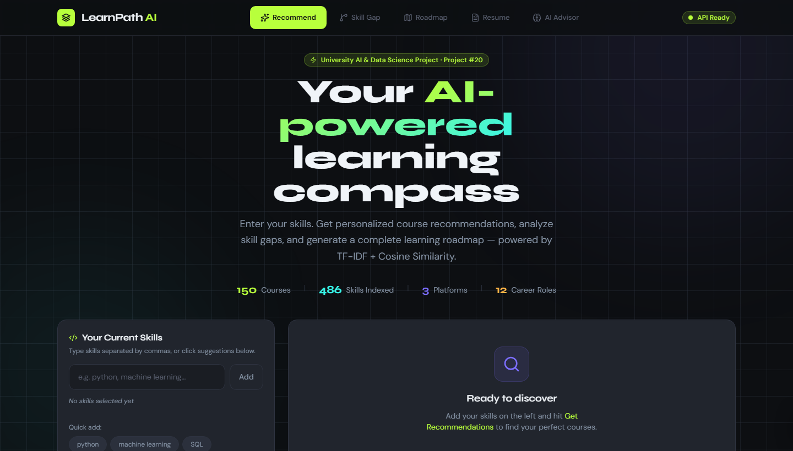
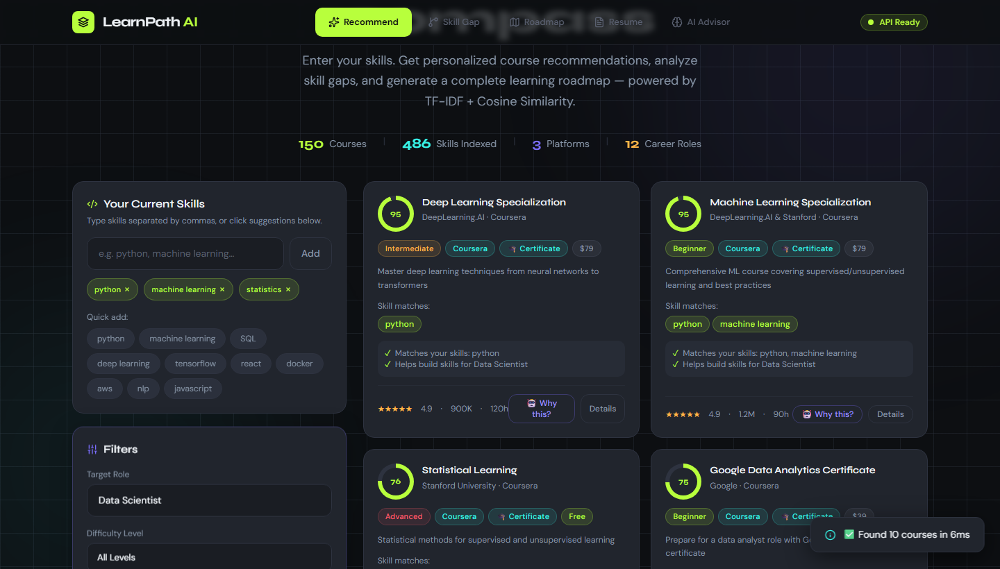
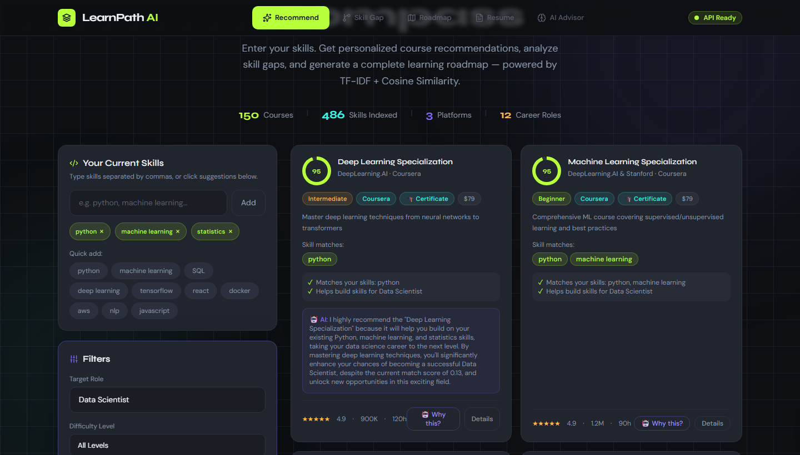
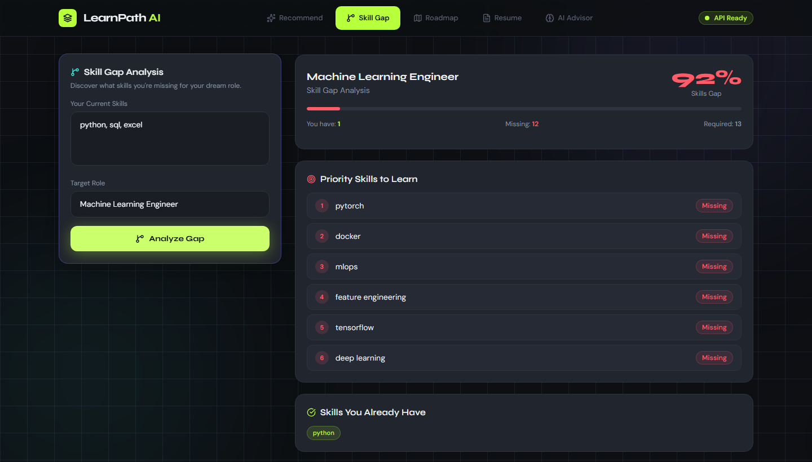
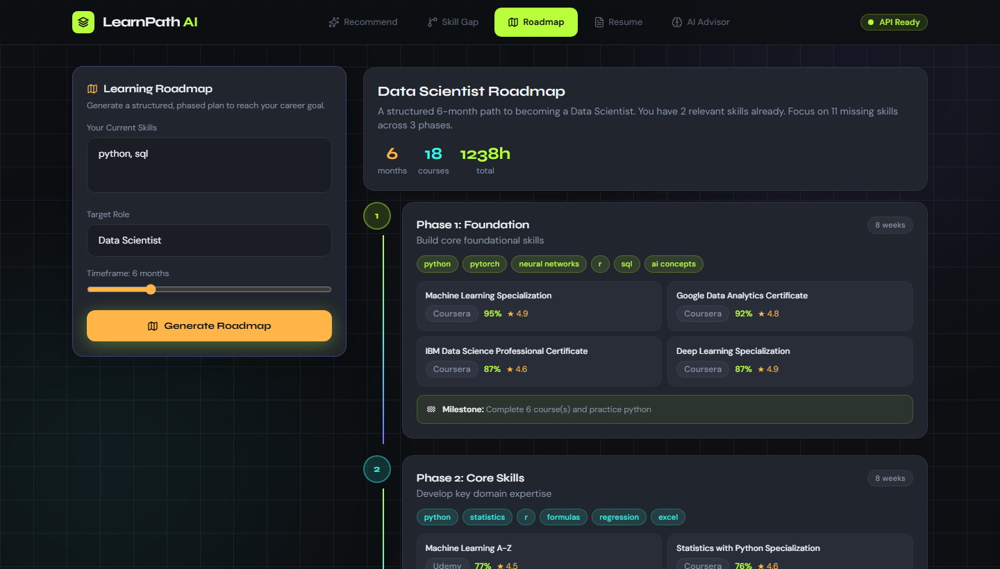
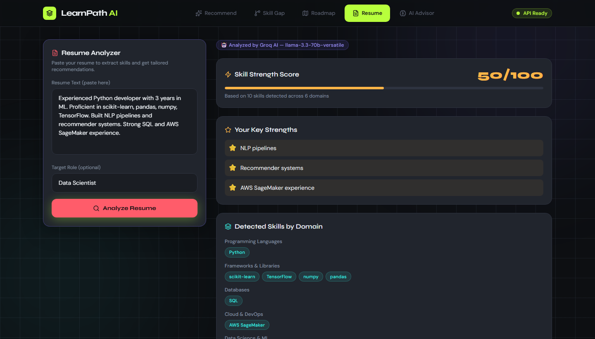
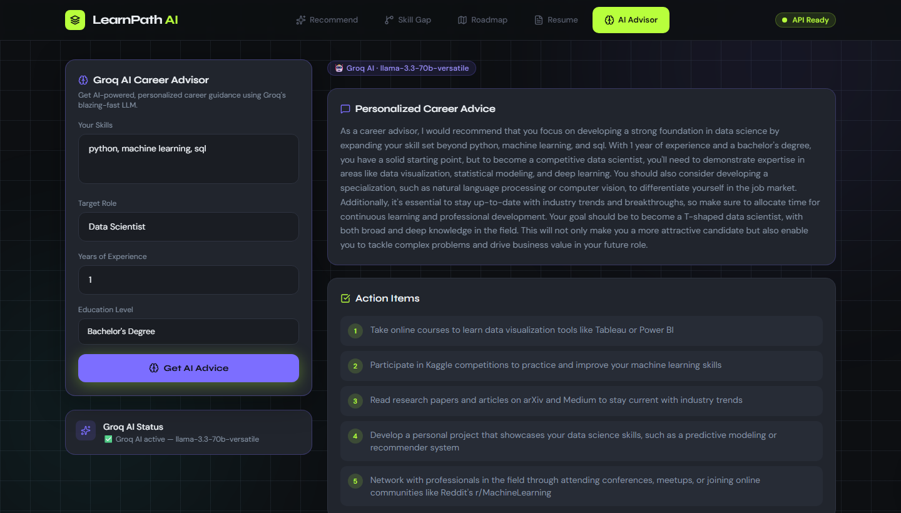

<div align="center">

# LearnPath AI — Learning Recommendation System

**ML-powered course recommender with Groq AI career coaching**

[](https://python.org)
[](https://fastapi.tiangolo.com)
[](https://groq.com)
[](https://tailwindcss.com)
[](LICENSE)

</div>

---

## Overview

LearnPath AI is a full-stack **learning recommendation system** that uses Machine Learning to suggest the most relevant online courses based on a user's current skills and career goals.

Built as a college assignment project covering:

| Stage | Topics |
|-------|--------|
| **Stage 1** | Dataset preparation · TF-IDF vectorization · Cosine similarity |
| **Stage 2** | Multi-factor scoring model · Testing · Evaluation |
| **Output** | Personalised course recommendations with match scores |

Beyond the core ML pipeline the app also includes an **AI Career Advisor** (powered by Groq's `llama-3.3-70b-versatile`) for natural-language coaching, a **Resume Analyzer**, and a **Skill Gap & Roadmap** planner.

---

## Screenshots

### Home — Skill Input


### ML Recommendations


### AI Explanation (Groq)


### Skill Gap Analysis


### Learning Roadmap


### Resume Analyzer


### AI Career Advisor


---

## Features

| Feature | Description |
|---------|-------------|
| **Course Recommender** | TF-IDF + Cosine Similarity on 150 real-world courses |
| **Match Score** | Multi-factor weighted scoring (55-95% normalised range) |
| **Role-Aware Ranking** | Role→Category boost promotes relevant domains |
| **Skill Gap Analysis** | Identifies missing skills for your target role |
| **Learning Roadmap** | Step-by-step plan from current skills to goal |
| **Resume Analyzer** | Extracts skills from plain-text resume (Groq AI) |
| **AI Career Advisor** | Real LLM chat powered by Groq (llama-3.3-70b) |
| **AI Explain Button** | Per-card "Why this?" LLM explanation |
| **Profile Persistence** | Skills & role auto-saved in localStorage |

---

## How It Works

```
User Skills + Target Role
         │
         ▼
┌─────────────────────────────────────────────┐
│           TF-IDF Vectorizer                 │
│  (150 courses × 4 835 vocabulary features)  │
└──────────────────┬──────────────────────────┘
                   │  Cosine Similarity
                   ▼
┌─────────────────────────────────────────────┐
│         Multi-Factor Scorer                 │
│  55% similarity + 20% rating               │
│  15% popularity + 10% difficulty           │
│  10% role-category boost                   │
└──────────────────┬──────────────────────────┘
                   │  Min-Max normalise → 55–95%
                   ▼
          Top-N Recommendations
```

The ML layer is **100% offline** — no API calls needed for recommendations. Groq AI is only used for the Career Advisor, Resume Analyzer, and the "Why this?" explain button.

---

## Tech Stack

### Backend
- **FastAPI** — async REST API
- **scikit-learn** — TF-IDF vectorization & cosine similarity
- **pandas / numpy** — data processing
- **Groq API** (OpenAI-compatible) — LLM features
- **Pydantic v2 / pydantic-settings** — config & validation

### Frontend
- Vanilla **JavaScript** (no framework)
- **Tailwind CSS** (CDN) — dark theme with acid-green accent (#B8FF3C)
- `localStorage` for profile persistence

### Dataset
- **150 courses** hand-curated across 15+ categories
- Platforms: Coursera, Udemy, edX, Pluralsight, LinkedIn Learning, and more
- 17 attributes: title, platform, provider, category, skills, difficulty, rating, enrolled, price, etc.

---

## Installation

### Prerequisites
- Python 3.10+
- A free [Groq API key](https://console.groq.com/) (for AI features)

### Steps

```bash
# 1. Clone the repository
git clone https://github.com/Om-Bhandwalkar02/learning-recommendation-system.git
cd learning-recommendation-system

# 2. Create virtual environment
python -m venv .venv

# Windows
.venv\Scripts\activate

# macOS / Linux
source .venv/bin/activate

# 3. Install dependencies
pip install -r requirements.txt

# 4. Configure environment
copy .env.example .env      # Windows
cp  .env.example .env       # macOS/Linux
# Then open .env and add your GROQ_API_KEY

# 5. Start the server
python -m uvicorn backend.main:app --reload --port 8000
```

Open **http://localhost:8000** in your browser.

---

## Environment Variables

Create a `.env` file (never commit it):

```env
GROQ_API_KEY=your_groq_api_key_here
GROQ_MODEL=llama-3.3-70b-versatile
ALLOWED_ORIGINS=http://localhost:8000,http://127.0.0.1:8000
```

---

## API Endpoints

| Method | Endpoint | Description |
|--------|----------|-------------|
| `GET` | `/` | Serves the frontend |
| `GET` | `/health` | Health check |
| `POST` | `/api/analyze/recommend` | Get ML course recommendations |
| `POST` | `/api/analyze/skill-gap` | Identify skill gaps |
| `POST` | `/api/analyze/roadmap` | Generate learning roadmap |
| `POST` | `/api/analyze/resume-analyze` | Analyze resume text |
| `POST` | `/api/analyze/explain` | AI explanation for a course |
| `POST` | `/api/advisor/chat` | AI career advisor chat |
| `GET` | `/api/advisor/status` | Check Groq API connectivity |

### Example — Recommend Courses

```bash
curl -X POST http://localhost:8000/api/analyze/recommend \
  -H "Content-Type: application/json" \
  -d '{
    "skills": ["python", "machine learning", "sql"],
    "target_role": "Data Scientist",
    "difficulty": "intermediate",
    "top_n": 8
  }'
```

**Response:**
```json
{
  "success": true,
  "recommendations": [
    {
      "title": "Machine Learning A-Z",
      "platform": "Udemy",
      "match_score": 94.7,
      "rating": 4.5,
      "difficulty": "Intermediate",
      ...
    }
  ],
  "total_found": 8,
  "powered_by": "TF-IDF + Cosine Similarity"
}
```

---

## Project Structure

```
learning-recommendation-system/
├── backend/
│   ├── main.py                  # FastAPI app entry point
│   ├── api/
│   │   └── routes/
│   │       ├── analyze.py       # /recommend, /skill-gap, /roadmap, /resume
│   │       └── advisor.py       # /chat, /status
│   └── ml/
│       ├── engine.py            # TF-IDF model + scoring logic
│       └── groq_service.py      # Groq API wrapper
├── data/
│   └── courses.csv              # 150 curated courses
├── frontend/
│   ├── index.html               # Single-page app shell
│   └── assets/
│       └── js/
│           └── app.js           # All frontend logic
├── docs/
│   └── screenshots/             # App screenshots for README
├── .env.example                 # Template (copy → .env, add key)
├── requirements.txt
└── README.md
```

---

## ML Model Details

### Vectorization
- **Algorithm:** TF-IDF (Term Frequency–Inverse Document Frequency)
- **Input corpus:** Course titles + descriptions + skills + categories
- **Vocabulary size:** ~4,835 features
- **Matrix:** 150 docs × 4,835 features

### Similarity
- **Algorithm:** Cosine Similarity
- **Threshold:** similarity < 0.04 filtered out (avoids irrelevant results)

### Scoring Formula
```
raw_score = 0.55 × similarity
          + 0.20 × rating_norm
          + 0.15 × popularity_norm
          + 0.10 × difficulty_match
          + 0.10 × role_category_boost

final_score = 55 + 40 × (raw - min) / (max - min)   ← normalised to 55–95%
```

### Role-Category Boost
Maps job roles to relevant course categories:

| Role | Boosted Categories |
|------|--------------------|
| Data Scientist | Data Science, AI/ML, Statistics |
| Full Stack | Web Development, Databases |
| DevOps | DevOps, Cloud |
| Cybersecurity | Security |
| Mobile Developer | Mobile Development |

---

## Assignment Context

| Field | Value |
|-------|-------|
| **Title** | Learning Recommendation System |
| **Problem** | Recommend relevant online courses to learners |
| **Dataset** | Custom (150 real-world courses, 17 attributes) |
| **Tools** | Machine Learning (scikit-learn, pandas, numpy) |
| **Stage 1** | Data preparation, TF-IDF vectorization, Cosine similarity |
| **Stage 2** | Weighted scoring model, threshold filtering, evaluation |
| **Output** | Ranked course recommendations with match % scores |

---

## Author

**Om Bhandwalkar**  
GitHub: [@Om-Bhandwalkar02](https://github.com/Om-Bhandwalkar02)

---

<div align="center">
Built with FastAPI · scikit-learn · Groq AI · Tailwind CSS
</div>
